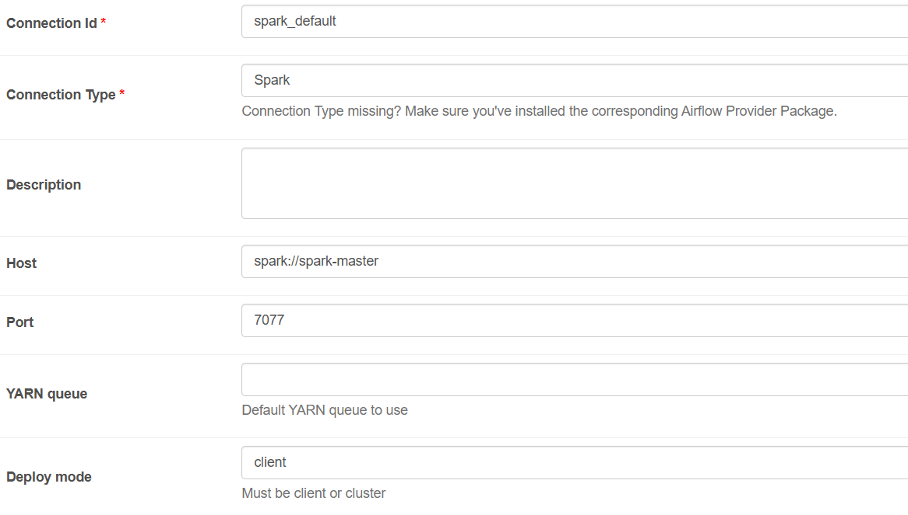
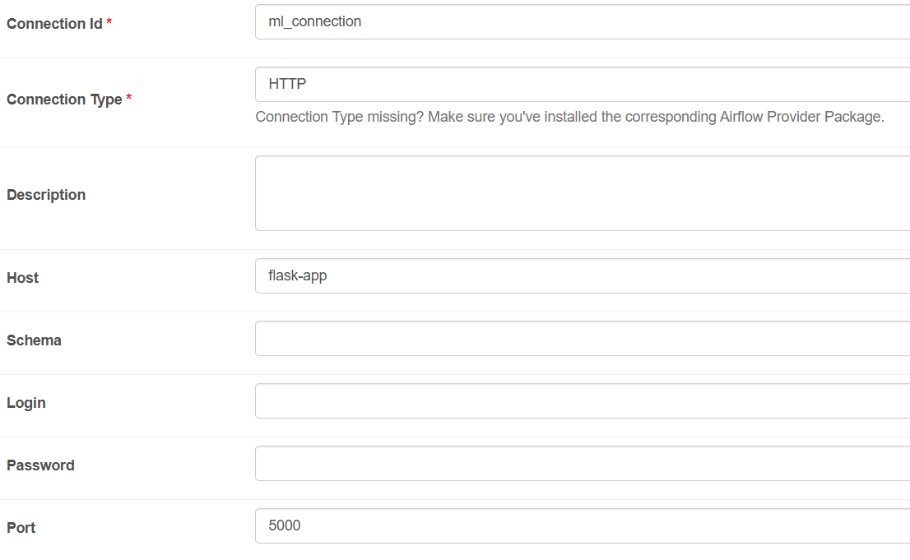

### Setup Docker Network

```sh
docker network create -d bridge data_platform
```

### Setup Airflow

```sh
cd airflow-delta
docker build -t airflow-spark-delta:1.0 .
echo -e "AIRFLOW_UID=$(id -u)" > .env # For running in Linux or wsl
docker-compose up -d
```

### Setup Hadoop

```sh
cd hdfs-dataplatform
docker-compose up -d
```

### Setup ml and streamlit

```sh
cd ml
docker-compose up -d
```

### Setup Spark

```sh
cd spark-delta
docker-compose up -d
```

### Setup Confuent/Kafka

```sh
cd Kafka
docker-compose up -d
```

### To Stop container

```sh
docker-compose down
```
To remove volume
```sh
docker-compose down -v
```

### Setup Spark connection in Airflow
From Airflow web UI

admin -> connections -> new connection ( + button)

config connection as follow



### Setup retrain ml connection in Airflow
From Airflow web UI

admin -> connections -> new connection ( + button)

config connection as follow

